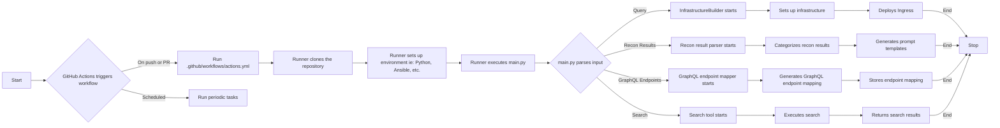
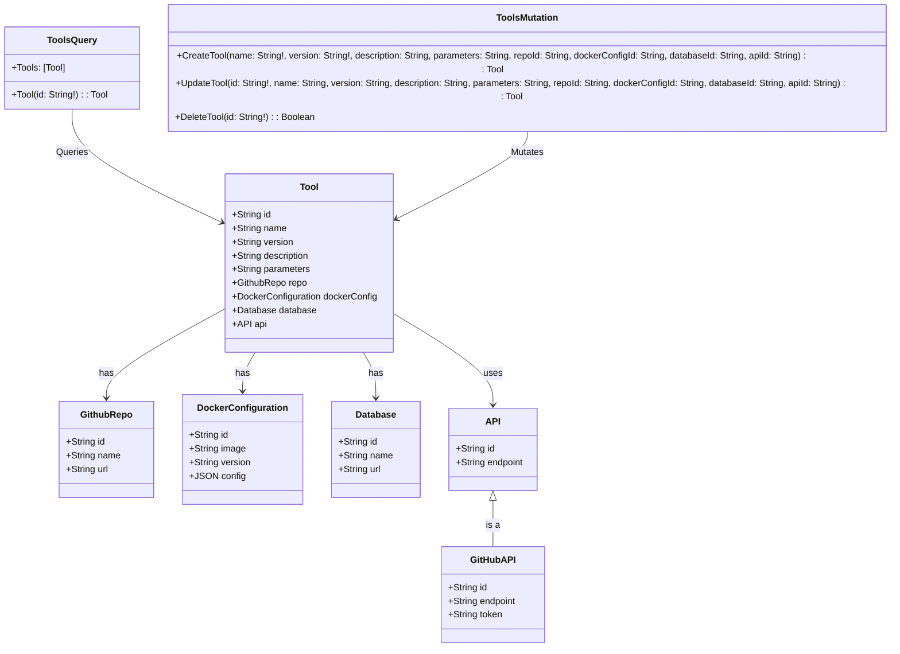

# Langchain BugBounty-Infrastructure

### Development Roadmap

Ordering your Notion page's entries is a critical aspect of designing your software. It will largely depend on the logical flow of the program, and the dependencies between the components of your software. From what you've provided, here's a suggested order. I've tried to follow a flow from setting up the infrastructure, to creating the chatbot UI, and then to processing and categorizing recon results, and finally to deploying and managing the project.

1. Example of Modal Python Cloning Repo
2. Example of Python Gradio UI Chatbot
3. InfrastructureBuilder
4. InfrastructureBuilder args/schema JSON
5. Example of Starting Tools Configuration Depth in JSON
6. Example of Tools.json as Jinja2 Template
7. Example of Ansible Role Builder
8. Example of Ansible Tailscale Inventory
9. Example of Role: ATTACK Dockerfile and how it might install tools from Github Repository
10. Custom Tool that Deploys Ingress
11. Example of how to parse recon results
12. Example of Different Chains for recon result category
13. Example of Categorizing Recon Results with Python
14. Custom Tool that processes a directory of recon results and generates a dictionary mapping GraphQL endpoints
15. Example Prompt Templates for processing recon results
16. Example of Results Schema (graph)
17. Example of Tool Schema (graph)
18. Custom Tool that can Search
19. Example of Github Actions Workflow/Webhook to
20. Example of Google Project Deployment Manager
21. REQUIRE query: string input
22. Example of Langchain Custom Tools

Again, this order is suggested based on my understanding of the components and their logical flow. The actual order might need adjustment based on the specific interdependencies of your application's components.

---

### Example of Github Repository Structure

```
bug-bounty-hunting-ai/
│
├───.github/
│   └───workflows/
│       └───actions.yml     # Github Actions Workflow
│
├───ansible/
│   ├───roles/               # Ansible roles
│   └───inventory/           # Ansible Tailscale Inventory
│
├───docker/
│   └───Dockerfile          # Dockerfile for ATTACK role
│
├───graphql/
│   └───endpoints/          # Mapping GraphQL Endpoints
│
├───langchain/
│   └───custom_tools/       # Langchain Custom Tools
│
├───modal/
│   └───clone.py            # Modal Python Cloning Repo
│
├───gradio/
│   └───chatbot.py          # Python Gradio UI Chatbot
│
├───infrastructure/
│   ├───builder.py          # InfrastructureBuilder
│   └───schema.json         # InfrastructureBuilder args/schema JSON
│
├───parsers/
│   └───parse_recon.py      # Parse Recon Results
│
├───results/
│   └───schema.graph        # Results Schema (graph)
│
├───tools/
│   ├───deploy_ingress.py   # Tool that Deploys Ingress
│   ├───search.py           # Tool that can Search
│   ├───tools.json          # Starting Tools Configuration Depth in JSON
│   └───tools_schema.graph  # Tools Schema (graph)
│
├───templates/
│   └───prompts.j2          # Prompt Templates for processing recon results
│
├───deployment/
│   └───manager.py          # Google Project Deployment Manager
│
├───main.py                 # Main entry point
│
├───requirements.txt        # Python requirements
│
└───README.md               # README
```

---

### Mermaid depicted Repository Structure

```mermaid
graph TD
    A[bug-bounty-hunting-ai]
    B[.github/workflows]
    C[ansible]
    D[docker]
    E[graphql]
    F[langchain]
    G[modal]
    H[gradio]
    I[infrastructure]
    J[parsers]
    K[results]
    L[tools]
    M[templates]
    N[deployment]
    O[main.py]
    P[requirements.txt]
    Q[README.md]
    
    A --> B
    A --> C
    A --> D
    A --> E
    A --> F
    A --> G
    A --> H
    A --> I
    A --> J
    A --> K
    A --> L
    A --> M
    A --> N
    A --> O
    A --> P
    A --> Q
    
    B --> Ba[actions.yml]
    
    C --> Ca[roles]
    C --> Cb[inventory]
    
    D --> Da[Dockerfile]
    
    E --> Ea[endpoints]
    
    F --> Fa[custom_tools]
    
    G --> Ga[clone.py]
    
    H --> Ha[chatbot.py]
    
    I --> Ia[builder.py]
    I --> Ib[schema.json]
    
    J --> Ja[parse_recon.py]
    
    K --> Ka[schema.graph]
    
    L --> La[deploy_ingress.py]
    L --> Lb[search.py]
    L --> Lc[tools.json]
    L --> Ld[tools_schema.graph]
    
    M --> Ma[prompts.j2]
    
    N --> Na[manager.py]
```



---

### Mermaid depicted Lifecycle/Workflow



---

### Classes for Data Flow

Here's an expanded version of the previous diagram that includes `CouchDB`, `GraphQLAPI`, and `GitHubAPI` classes. The `Database` class represents the CouchDB database, and the `API` class represents the GraphQL API. The `GitHubAPI` class is a subclass of the `API` class, representing the specific case of the GitHub API. The `Tool` class has been updated to include a `database` field linking to a `Database` instance and an `api` field linking to an `API` instance.



This diagram should give you an idea of how the different components of your system can interact. The specifics of how to implement this will depend on your exact requirements and the details of your environment. Please note that you'll need to write resolvers to handle the GraphQL queries and mutations, and you'll need to configure CouchDB and the APIs to work with your system.

---

### Example Prompt for Building Autonomous Bug Bounty Hunting Agents

This guide provides an overview of building an autonomous agent for the bug bounty hunting process. We will focus on the Configuration Agent (ConfigAgent), an integral part of the system. This agent's role is to automate the configuration of various tools, each represented by a separate GitHub repository, used in the bug bounty hunting process.

## Skeleton Code

Here's a basic skeleton of what the ConfigAgent might look like in Python:

```python
from superagi.tools.base_tool import BaseTool
from typing import Type, Optional, List
from pydantic import BaseModel, Field
import git
from gql_codegen import generate_gql_schema

# Define the schema for the ConfigAgent
class ConfigAgentSchema(BaseModel):
    tool_repository: str = Field(
        ...,
        description="GitHub URL of the tool to be configured.",
    )

# Define the ConfigAgent itself
class ConfigAgent(BaseTool):
    name = "ConfigAgent"
    description = (
        "Automates the configuration of various tools used in the bug bounty hunting process."
    )
    args_schema: Type[ConfigAgentSchema] = ConfigAgentSchema
    goals: List[str] = []

    def _execute(self, tool_repository: str):
        # Clone the repository
        git.Repo.clone_from(tool_repository, './repo')

        # Parse the README and other documentation
        # This is a placeholder - you'll need to add the real parsing logic
        parsed_docs = parse_docs('./repo')

        # Generate the GraphQL schema
        schema_filename = f"{self.name}_schema.graphql"
        generate_gql_schema(parsed_docs, schema_filename)

        print(f"Configured tool in repository: {tool_repository}, GQL schema saved in {schema_filename}")

```

In this skeleton code, we've added the steps to clone the repository from the provided GitHub URL and generate a GraphQL schema based on the parsed documentation. The `generate_gql_schema` function is a placeholder - you'll need to implement this function to convert the parsed documentation into a GraphQL schema.

When defining your autonomous agents, remember to break down the problem into manageable parts, build each part separately, and then integrate them together. Thorough testing is key to ensure they're behaving as expected before deploying them in a live environment.

## Debugging

Once you have written your scripts, you will want to debug them to ensure they're working as expected. Here's an example of how you might do this:

```
if __name__ == "__main__":
    # Initialize the agent
    agent = ConfigAgent()

    # Test the agent with a known repository
    test_repository = "<https://github.com/user/repo>"
    agent._execute(test_repository)

    # Check the output files and verify the GQL schema
    with open(f"{agent.name}_schema.graphql", 'r') as schema_file:
        schema = schema_file.read()
        print(schema)

```

This script will run the ConfigAgent on a known repository, outputting the GraphQL schema to the console for verification. By running this script, you can catch and fix any errors in your agent before deploying it in a production environment. Remember to use a variety of test cases to ensure your agent can handle a wide range of scenarios

---

### ReconResultsAgent

**Description**

The ReconResultsAgent is designed to process reconnaissance results and generate GraphQL (GQL) types. This agent plays a crucial role in transforming raw data from reconnaissance tools into a structured format that can be readily integrated into your existing GQL schema.

**Skeleton Code**

```
from superagi.tools.base_tool import BaseTool
from typing import Type, Optional, List
from pydantic import BaseModel, Field
from gql_codegen import generate_gql_types

class ReconResultsAgentSchema(BaseModel):
    results_file: str = Field(
        ...,
        description="The path to the file containing the reconnaissance results."
    )

class ReconResultsAgent(BaseTool):
    name = "ReconResultsAgent"
    description = (
        "Processes reconnaissance results, generates GQL types based on these results, and integrates these types into the existing GQL schema."
    )
    args_schema: Type[ReconResultsAgentSchema] = ReconResultsAgentSchema
    goals: List[str] = []

    def _execute(self, results_file: str):
        # Load the reconnaissance results
        # Placeholder - actual implementation needed
        results = load_results(results_file)

        # Generate the GQL types
        # The filename for the generated GQL types
        types_filename = f"{self.name}_types.graphql"
        generate_gql_types(results, types_filename)

        print(f"Processed reconnaissance results from: {results_file}, GQL types saved in {types_filename}")

```

**Debugging**

To debug this script, you can run it with a test reconnaissance results file and ensure that it correctly generates the expected GQL types. If the script fails or generates incorrect GQL types, use Python's built-in debugging tools or your preferred Python debugger to step through the code and identify the problem.

Example debugging code:

```
import pdb

def test_recon_results_agent():
    # Instantiate the ReconResultsAgent
    agent = ReconResultsAgent()

    # Set a breakpoint here to start debugging
    pdb.set_trace()

    # Execute the agent with a test results file
    agent._execute('test_results.json')

test_recon_results_agent()

```

This debugging code uses Python's built-in `pdb` module to set a breakpoint before the agent is executed. When you run this script, the program will pause at the breakpoint, allowing you to step through the code and inspect the program's state.

---

### InfrastructureBuilder

**Description**

The InfrastructureBuilderAgent is designed to create dynamic infrastructure configurations based on the requirements of the bug bounty hunting tools. It generates Ansible roles and Dockerfiles to ensure the necessary environments are set up for each tool.

**Skeleton Code**

```
from superagi.tools.base_tool import BaseTool
from typing import Type, Optional, List
from pydantic import BaseModel, Field
from ansible_codegen import generate_ansible_role
from docker_codegen import generate_dockerfile

class InfrastructureBuilderAgentSchema(BaseModel):
    tool_config: str = Field(
        ...,
        description="The path to the file containing the tool's configuration."
    )

class InfrastructureBuilderAgent(BaseTool):
    name = "InfrastructureBuilderAgent"
    description = (
        "Generates dynamic infrastructure configurations, including Ansible roles and Dockerfiles, based on each tool's requirements."
    )
    args_schema: Type[InfrastructureBuilderAgentSchema] = InfrastructureBuilderAgentSchema
    goals: List[str] = []

    def _execute(self, tool_config: str):
        # Load the tool's configuration
        # Placeholder - actual implementation needed
        config = load_tool_config(tool_config)

        # Generate the Ansible role
        # The filename for the generated Ansible role
        ansible_filename = f"{self.name}_ansible_role.yml"
        generate_ansible_role(config, ansible_filename)

        # Generate the Dockerfile
        # The filename for the generated Dockerfile
        docker_filename = f"{self.name}_Dockerfile"
        generate_dockerfile(config, docker_filename)

        print(f"Processed tool configuration from: {tool_config}, Ansible role saved in {ansible_filename}, Dockerfile saved in {docker_filename}")

```

**Debugging**

To debug this script, you can run it with a test tool configuration file and ensure that it correctly generates the expected Ansible role and Dockerfile. If the script fails or generates incorrect files, use Python's built-in debugging tools or your preferred Python debugger to step through the code and identify the problem.

Example debugging code:

```
import pdb

def test_infrastructure_builder_agent():
    # Instantiate the InfrastructureBuilderAgent
    agent = InfrastructureBuilderAgent()

    # Set a breakpoint here to start debugging
    pdb.set_trace()

    # Execute the agent with a test tool configuration file
    agent._execute('test_tool_config.json')

test_infrastructure_builder_agent()

```

This debugging code uses Python's built-in `pdb` module to set a breakpoint before the agent is executed. When you run this script, the program will pause at the breakpoint, allowing you to step through the code and inspect the program's state.

---

### GithubActionRunnerWorkflowBuilder

**Description**

The GithubActionRunnerWorkflowGenerator is designed to automate the generation of GitHub workflows that will use the Ansible roles created by the InfrastructureBuilderAgent. These workflows will set up the necessary environments and run the bug bounty hunting tools.

**Skeleton Code**

```
from superagi.tools.base_tool import BaseTool
from typing import Type, Optional, List
from pydantic import BaseModel, Field
from github_workflow_codegen import generate_github_workflow

class GithubActionRunnerWorkflowGeneratorSchema(BaseModel):
    ansible_role_file: str = Field(
        ...,
        description="The path to the file containing the Ansible role."
    )

class GithubActionRunnerWorkflowGenerator(BaseTool):
    name = "GithubActionRunnerWorkflowGenerator"
    description = (
        "Automates the generation of GitHub workflows that use the Ansible roles created by the InfrastructureBuilderAgent."
    )
    args_schema: Type[GithubActionRunnerWorkflowGeneratorSchema] = GithubActionRunnerWorkflowGeneratorSchema
    goals: List[str] = []

    def _execute(self, ansible_role_file: str):
        # Generate the GitHub workflow
        # The filename for the generated GitHub workflow
        workflow_filename = f"{self.name}_workflow.yml"
        generate_github_workflow(ansible_role_file, workflow_filename)

        print(f"Processed Ansible role from: {ansible_role_file}, GitHub workflow saved in {workflow_filename}")

```

**Debugging**

To debug this script, you can run it with a test Ansible role file and ensure that it correctly generates the expected GitHub workflow. If the script fails or generates incorrect workflows, use Python's built-in debugging tools or your preferred Python debugger to step through the code and identify the problem.

Example debugging code:

```
import pdb

def test_github_action_runner_workflow_generator():
    # Instantiate the GithubActionRunnerWorkflowGenerator
    generator = GithubActionRunnerWorkflowGenerator()

    # Set a breakpoint here to start debugging
    pdb.set_trace()

    # Execute the generator with a test Ansible role file
    generator._execute('test_ansible_role.yml')

test_github_action_runner_workflow_generator()

```

This debugging code uses Python's built-in `pdb` module to set a breakpoint before the generator is executed. When you run this script, the program will pause at the breakpoint, allowing you to step through the code and inspect the program's state.

---

### FlaskAPIReceiver

**Description**

The FlaskAPIAgent is designed to set up a Flask API that can receive and process commands from GitHub Actions runners operating on a hacking server. The agent will handle incoming requests, carry out the corresponding actions, and return the appropriate responses.

**Skeleton Code**

```
from flask import Flask, request, jsonify
from superagi.tools.base_tool import BaseTool
from typing import Type, Optional, List
from pydantic import BaseModel, Field

class FlaskAPIAgentSchema(BaseModel):
    server_port: int = Field(
        ...,
        description="The port number on which the Flask API server will run."
    )

class FlaskAPIAgent(BaseTool):
    name = "FlaskAPIAgent"
    description = (
        "Sets up a Flask API that can receive and process commands from GitHub Actions runners."
    )
    args_schema: Type[FlaskAPIAgentSchema] = FlaskAPIAgentSchema
    goals: List[str] = []

    def _execute(self, server_port: int):
        app = Flask(__name__)

        @app.route('/command', methods=['POST'])
        def receive_command():
            command_data = request.get_json()
            # Process the command data...
            # Return a response...
            return jsonify({"message": "Command received and processed."})

        app.run(host='0.0.0.0', port=server_port)

```

**Debugging**

To debug this script, you can send test POST requests to the '/command' endpoint and ensure that the Flask API handles them correctly. If the script fails or handles requests incorrectly, use Python's built-in debugging tools or your preferred Python debugger to step through the code and identify the problem.

Example debugging code:

```
import requests

def test_flask_api_agent():
    # Define the URL of the '/command' endpoint
    url = '<http://localhost:5000/command>'

    # Define a test command
    test_command = {"command": "test"}

    # Send a POST request to the '/command' endpoint
    response = requests.post(url, json=test_command)

    # Print the response
    print(response.json())

test_flask_api_agent()

```

This debugging code sends a test POST request to the '/command' endpoint and prints the response. You can compare the printed response to the expected response to check if the Flask API is working correctly.

---

### Example of `[Modal.com](http://Modal.com)` GithubRepo_Secret Usage

```python
import os
import tempfile

import modal

stub = modal.Stub()
pygithub_image = modal.Image.debian_slim().pip_install("PyGithub")
git_image = modal.Image.debian_slim().apt_install("git").pip_install("GitPython")

@stub.function(image=pygithub_image, secret=modal.Secret.from_name("my-github-secret"))
def get_username():
    import github

    g = github.Github(os.environ["GITHUB_TOKEN"])
    return g.get_user().login

@stub.function(image=git_image, secret=modal.Secret.from_name("my-github-secret"))
def clone_repo(repo_url, branch="main"):
    import git

    assert repo_url.startswith("https://")
    repo_url_with_creds = repo_url.replace("https://", "https://" + os.environ["GITHUB_TOKEN"] + "@")
    with tempfile.TemporaryDirectory() as dname:
        print("Cloning", repo_url, "to", dname)
        git.Repo.clone_from(repo_url_with_creds, dname, branch=branch)
        return os.listdir(dname)

@stub.local_entrypoint()
def main(repo_url: str):
    # Run this script with a repo url passed as a command line option
    # For instance `python github_clone_repo.py https://github.com/myuser/myrepo`
    # The repo can be private
    print("Github username:", get_username.call())
    print("Repo files:", clone_repo.call(repo_url))
```

### Example of `[Modal.com](http://Modal.com)` Openai_Secret Usage

```python
import modal

stub = modal.Stub(image=modal.Image.debian_slim().pip_install("openai"))

@stub.function(secret=modal.Secret.from_name("my-openai-secret"))
def complete_text(prompt):
    import openai

    completion = openai.Completion.create(model="ada", prompt=prompt)
    return completion.choices[0].text

@stub.local_entrypoint()
def main(prompt: str = "The best way to run Python code in the cloud"):
    completion = complete_text.call(prompt)
    print(prompt + completion)
```

### Example of `[Modal.com](http://Modal.com)` GoogleCloud_Secret Usage

```python
import json
import os

import modal

stub = modal.Stub(image=modal.Image.debian_slim().pip_install("google-cloud-bigquery"))

@stub.function(secret=modal.Secret.from_name("my-googlecloud-secret"))
def query():
    from google.cloud import bigquery
    from google.oauth2 import service_account

    service_account_info = json.loads(os.environ["SERVICE_ACCOUNT_JSON"])
    credentials = service_account.Credentials.from_service_account_info(service_account_info)
    client = bigquery.Client(credentials=credentials)

    # Run a query against a public dataset with name US first name statistics
    query = """
        SELECT name, SUM(number) as total_people
        FROM `bigquery-public-data.usa_names.usa_1910_2013`
        WHERE state = 'TX'
        GROUP BY name, state
        ORDER BY total_people DESC
        LIMIT 20
    """
    query_job = client.query(query)
    # This will print {'James': 272793, 'John': 235139, 'Michael': 225320, ...
    return {row["name"]: row["total_people"] for row in query_job}
```

### Example of `[Modal.com](http://Modal.com)` HuggingFace_Secret Usage

```python
import io
import os

import modal

stub = modal.Stub()

@stub.function(
    image=modal.Image.debian_slim().pip_install("torch", "diffusers[torch]", "transformers", "ftfy"),
    secret=modal.Secret.from_name("my-huggingface-secret"),
    gpu="any",
)
async def run_stable_diffusion(prompt: str):
    from diffusers import StableDiffusionPipeline

    pipe = StableDiffusionPipeline.from_pretrained(
        "runwayml/stable-diffusion-v1-5",
        use_auth_token=os.environ["HUGGINGFACE_TOKEN"],
    ).to("cuda")

    image = pipe(prompt, num_inference_steps=10).images[0]

    buf = io.BytesIO()
    image.save(buf, format="PNG")
    img_bytes = buf.getvalue()

    return img_bytes

@stub.local_entrypoint()
def main():
    img_bytes = run_stable_diffusion.call("Wu-Tang Clan climbing Mount Everest")
    with open("/tmp/output.png", "wb") as f:
        f.write(img_bytes)
```

---

### Example of Python Gradio UI Chatbot

```python
Let's create a Flask API that uses OpenAI's GPT-3 to handle the conversational history and generate responses to user input. We'll also add a Gradio interface so you can easily interact with the API.

Here's how you might do that:

First, let's start with the Flask API:

from flask import Flask, request, jsonify
import openai
from git import Repo, GitCommandError
import os
import base64
import shutil
from flask_caching import Cache

# Initialize Flask app
app = Flask(__name__)
cache = Cache(app, config={'CACHE_TYPE': 'simple'})

# Set OpenAI key
openai.api_key = 'your-api-key'

@app.route('/api/interact-with-repo', methods=['POST'])
def interact_with_repo():
    # ... Your existing code ...

@app.route('/api/chat', methods=['POST'])
def chat():
    conversation_history = cache.get('conversation_history') or [
        {"role": "system", "content": "You are a helpful assistant."},
    ]
    user_message = request.json['message']
    conversation_history.append({"role": "user", "content": user_message})

    response = openai.ChatCompletion.create(
        model="gpt-3.5-turbo",
        messages=conversation_history
    )
    content = response['choices'][0]['message']['content']
    conversation_history.append({"role": "assistant", "content": content})

    # Store the updated conversation history
    cache.set('conversation_history', conversation_history)

    return jsonify({'message': content})

if __name__ == '__main__':
    app.run(debug=True)
Now, let's create a Gradio interface that interacts with this API:

import gradio as gr
import requests

def chat_with_ai(user_message):
    response = requests.post('http://localhost:5000/api/chat', json={'message': user_message})
    if response.status_code == 200:
        return response.json()['message']
    else:
        return "An error occurred."

iface = gr.Interface(fn=chat_with_ai, inputs="text", outputs="text")
iface.launch()
In this Gradio interface, you enter a message and it's sent to the Flask API which then interacts with GPT-3 and returns the AI's response. The response is then displayed in the Gradio interface.
```

---

### `InfrastructureBuilder`

- **Example 1:**
    
    ```python
    from typing import Type, Optional, List
    from pydantic import BaseModel, Field
    from superagi.agent.agent_prompt_builder import AgentPromptBuilder
    from superagi.llms.base_llm import BaseLlm
    from superagi.tools.base_tool import BaseTool
    
    class InfrastructureBuilderSchema(BaseModel):
        tool_repositories: List[str] = Field(..., description="List of tool repositories.")
        results_dictionary_path: str = Field(..., description="Path to the results dictionary.")
        github_runners: List[str] = Field(..., description="List of GitHub runners.")
        ansible_playbook_path: str = Field(..., description="Path to the Ansible playbook.")
        ansible_roles: List[str] = Field(..., description="List of Ansible roles.")
        destination_repository: str = Field(..., description="Destination repository for the build.")
    
    class InfrastructureBuilderTool(BaseTool):
        llm: Optional[BaseLlm] = None
        name = "InfrastructureBuilderTool"
        description = ("Automates the setup, management, and deployment of bug bounty projects. It handles tool "
                       "configuration, GitHub actions/workflows, and Ansible playbook/roles generation.")
        args_schema: Type[InfrastructureBuilderSchema] = InfrastructureBuilderSchema
        goals: List[str] = [
            "Automate the configuration of tools based on their repositories.",
            "Create GitHub actions and workflows for coordinating tools on runners.",
            "Dynamically write Ansible playbooks and roles for deploying GitHub runners.",
            "Handle errors and ensure the robustness of the infrastructure.",
            "Manage and maintain the infrastructure for conducting bug bounty projects.",
            "Ensure efficient orchestration of different tools and systems.",
            "Adapt to a wide range of project requirements.",
            "Streamline the process of conducting bug bounty projects.",
            "Develop a user-friendly platform for setting up bug bounty projects.",
            "Integrate with Jira for project management."
        ]
    
        def _configure_tools(self, tool_repositories: List[str]):
            # logic to automatically configure tools based on their repositories
            pass
    
        def _create_github_actions(self, tool_repositories: List[str], github_runners: List[str]):
            # logic to create GitHub actions and workflows for coordinating tools on runners
            pass
    
        def _write_ansible_playbooks(self, ansible_playbook_path: str, ansible_roles: List[str]):
            # logic to dynamically write Ansible playbooks and roles
            pass
    
        def _execute(self, *args: Any, **kwargs: Any):
            # logic to execute the tool
            # this could call the other methods defined above in the appropriate order
            pass
    
    ```
    
- **Example 2:**
    
    From your description, it sounds like the `_execute` function for your `InfrastructureBuilderTool` should do the following:
    
    1. Clone the primary repository.
    2. Clone the server repositories, which each have their own GitHub Action/Runner servers set up.
    3. Clone the tool repositories into each server.
    4. For each tool repository, evaluate the files and generate a `tool-config.yaml` file, which should contain:
        - Important information for the tool, such as Docker deployment details.
        - The location of the documentation for the tool, so that GPT-4 can write custom commands based on dynamic inputs.
        - Dynamic inputs, which are GPT-4-analyzed results categorized by dictionary (i.e., a list of results by format).
    5. Define all of the recon results and tools according to GraphQL.
    6. Instruct SuperAGI to write the workflows and actions needed to connect these inputs and outputs for the runner in question.
    
    Here's a high-level pseudocode sketch of how you might implement this functionality:
    
    ```
    class InfrastructureBuilderTool(BaseTool):
        # (Class definition omitted for brevity)
    
        def _execute(self, github_repos: List[str], destination_directory: str):
            # Clone the primary repository
            primary_repo = github_repos[0]
            self.clone_repo(primary_repo, destination_directory)
    
            # Clone the server repositories
            server_repos = github_repos[1:]
            for repo in server_repos:
                self.clone_repo(repo, destination_directory)
    
            # Clone the tool repositories into each server
            for server in servers:
                for tool_repo in tool_repos:
                    self.clone_repo(tool_repo, server.directory)
    
            # For each tool repository, evaluate files and generate tool-config.yaml
            for tool_repo in tool_repos:
                config = self.generate_config(tool_repo)
                self.write_config_file(tool_repo, config)
    
            # Define all of the recon results and tools per GraphQL
            self.define_results_and_tools_graphql()
    
            # Instruct SuperAGI to write the workflows and actions
            self.write_workflows_and_actions()
    
        def clone_repo(self, repo_url: str, destination_directory: str):
            # Your code here
    
        def generate_config(self, tool_repo):
            # Your code here
    
        def write_config_file(self, tool_repo, config):
            # Your code here
    
        def define_results_and_tools_graphql(self):
            # Your code here
    
        def write_workflows_and_actions(self):
            # Your code here
    
    ```
    
    In this sketch, I've assumed that you're going to be implementing some helper methods (`clone_repo`, `generate_config`, `write_config_file`, `define_results_and_tools_graphql`, `write_workflows_and_actions`) to organize the different parts of the `_execute` method. Each of these methods would need to be implemented with the actual code that performs the necessary operations.
    
    This is a high-level overview, and the actual implementation will depend on the specifics of your infrastructure, the structure of your GitHub repositories, the requirements of your tools, and so on. But I hope this gives you a good starting point for designing your `InfrastructureBuilderTool`.
    

---

### `InfrastructureBuilder` args/schema JSON

```python
{
    "type": "object",
    "properties": {
        "github": {
            "type": "object",
            "properties": {
                "token": {"type": "string"},
                "owner": {"type": "string"}
            },
            "required": ["token", "owner"]
        },
        "infrastructure_id": {
            "type": "string"
        },
        "runner_repos": {
            "type": "array",
            "items": {
                "type": "object",
                "properties": {
                    "name": {"type": "string"},
                    "tool_repos": {
                        "type": "array",
                        "items": {"type": "string"}
                    }
                },
                "required": ["name", "tool_repos"]
            }
        },
        "results_repo": {"type": "string"}
    },
    "required": ["github", "infrastructure_id", "runner_repos", "results_repo"]
}
```

---

### Example of Starting Tools Configuration Depth in JSON

```json
[
    {
        "Id": "1",
        "Asset": "couchdb",
        "Role": "DATABASE",
        "Src": "/Tools/couchdb",
        "Dest": "/opt/couchdb",
        "Config File": "/opt/couchdb/data/local.ini",
        "Repo": "https://github.com/apache/couchdb",
        "Prerequisite": "",
        "Docker Pull": "docker pull couchdb",
        "Command": "docker run -p 5984:5984 -d couchdb",
        "Reference": "",
        "Wordlist": ""
    },
    {
        "Id": "2",
        "Asset": "bbrf",
        "Role": "DATABASE",
        "Src": "/Tools/bbrf",
        "Dest": "/opt/bbrf",
        "Config File": "/opt/bbrf/config.json",
        "Repo": "https://github.com/Cdaprod/cda.reconftw",
        "Prerequisite": "sudo docker-compose up -d",
        "Docker Pull": "docker pull honoki/bbrf-server",
        "Command": "docker run -it honoki/bbrf-server",
        "Reference": "",
        "Wordlist": ""
    },
    {
        "Id": "3",
        "Asset": "ReconFTW",
        "Role": "ATTACK",
        "Src": "/Tools/ReconFTW",
        "Dest": "/opt/reconftw",
        "Config File": "/opt/reconftw/config.yaml",
        "Repo": "https://github.com/honoki/bbrf-server",
        "Prerequisite": "./install.sh",
        "Docker Pull": "docker pull six2dez/reconftw",
        "Command": "docker run -it six2dez/reconftw",
        "Reference": "",
        "Wordlist": ""
    },
    {
        "Id": "4",
        "Asset": "Amass",
        "Role": "ATTACK",
        "Src": "/Tools/Amass",
        "Dest": "/opt/amass",
        "Config File": "/opt/amass/config.ini",
        "Repo": "https://github.com/owasp-amass/amass",
        "Prerequisite": "docker pull caffix/amass",
        "Docker Pull": "docker pull caffix/amass",
        "Command": "docker run -v $HOME/.config/amass:/root/.config/amass -it caffix/amass enum -d http://example.com/",
        "Reference": "",
        "Wordlist": ""
    },
    {
        "Id": "5",
        "Asset": "Axiom",
        "Role": "ATTACK",
        "Src": "/Tools/Axiom",
        "Dest": "/opt/axiom",
        "Config File": "/opt/axiom/profiles.ini",
        "Repo": "https://github.com/pry0cc/axiom",
        "Prerequisite": "bash <(curl -s https://raw.githubusercontent.com/pry0cc/axiom/master/interact/axiom-configure)",
        "Docker Pull": "",
        "Command": "docker exec -it $(docker run -d -it --platform linux/amd64 ubuntu) sh -c \"apt update && apt install git -y && git clone https://github.com/pry0cc/axiom ~/.axiom/ && cd && .axiom/interact/axiom-configure\"",
        "Reference": "",
        "Wordlist": ""
    },
    {
        "Id": "6",
        "Asset": "Nuclei",
        "Role": "ATTACK",
        "Src": "/Tools/Nuclei",
        "Dest": "/opt/nuclei",
        "Config File": "/opt/nuclei/config.yaml",
        "Repo": "https://github.com/projectdiscovery/nuclei",
        "Prerequisite": "docker pull projectdiscovery/nuclei",
        "Docker Pull": "docker pull projectdiscovery/nuclei",
        "Command": "docker run -it projectdiscovery/nuclei",
        "Reference": "",
        "Wordlist": ""
    },
    {
        "Id": "7",
        "Asset": "XssStrike",
        "Role": "ATTACK",
        "Src": "/Tools/XssStrike",
        "Dest": "/opt/xssstrike",
        "Config File": "/opt/xssstrike/config.json",
        "Repo": "https://github.com/s0md3v/XSStrike",
        "Prerequisite": "pip install -r requirements.txt",
        "Docker Pull": "",
        "Command": "docker run -it xssstrike",
        "Reference": "https://github.com/s0md3v/XSStrike/wiki/For-Developers",
        "Wordlist": ""
    },
    {
        "Id": "8",
        "Asset": "XssHunter-Express",
        "Role": "ATTACK",
        "Src": "/Tools/XssHunter-Express",
        "Dest": "/opt/xsshunter-express",
        "Config File": "/opt/xsshunter-express/config.json",
        "Repo": "https://github.com/mandatoryprogrammer/xsshunter-express",
        "Prerequisite": "sudo docker-compose up -d",
        "Docker Pull": "docker pull lightsecops/xsshunter-express",
        "Command": "docker run -it lightsecops/xsshunter-express",
        "Reference": "",
        "Wordlist": ""
    },
    {
        "Id": "9",
        "Asset": "DefectDojo",
        "Role": "ATTACK",
        "Src": "/Tools/DefectDojo",
        "Dest": "/opt/DefectDojo",
        "Config File": "/opt/DefectDojo/django-DefectDojo/settings.py",
        "Repo": "https://github.com/DefectDojo/django-DefectDojo",
        "Prerequisite": "sudo docker-compose up",
        "Docker Pull": "docker pull appsecco/defectdojo",
        "Command": "docker run -it -p 8000:8000 appsecco/defectdojo",
        "Reference": "https://defectdojo.readthedocs.io/en/latest/",
        "Wordlist": ""
    }
]
```

---

### Example of `Tools.json` as Jinja2 Template

Here's an example of how you might use this data with a Jinja2 template:

```
from jinja2 import Template

template = Template('''

Id: {{ item['Id'] }}
Asset: {{ item['Asset'] }}
Role: {{ item['Role'] }}
Source: {{ item['Src'] }}
Destination: {{ item['Dest'] }}
Config File: {{ item['Config File'] }}
Repo: {{ item['Repo'] }}
Prerequisite: {{ item['Prerequisite'] }}
Docker Pull: {{ item['Docker Pull'] }}
Command: {{ item['Command'] }}
Reference: {{ item['Reference'] }}
Wordlist: {{ item['Wordlist'] }}

''')

rendered = template.render(data=data)
print(rendered)

```

In this example, `data` should be your JSON data that's been loaded into a Python list of dictionaries (which you can do using `json.load()` as shown in the previous examples). This script will loop over each item in the data and print out the values for each field. You can adjust the template as needed to fit your needs.

---

### Example of **Ansible Role Builder**

```jsx
import os
import logging
from flask import Flask, request, jsonify
from flask_limiter import Limiter
import openai

app = Flask(__name__)

# Limit the rate of API calls
limiter = Limiter(app, key_func=get_remote_address)

# Configuring logging
logging.basicConfig(level=logging.INFO)

# Set up OpenAI API key
openai.api_key = os.getenv("OPENAI_API_KEY")

@app.route('/generate_structure', methods=['POST'])
@limiter.limit("5 per minute")  # adjust as needed
def generate_structure():
    data = request.json

    tool_name = data.get('tool_name')
    additional_info = data.get('additional_info')  # Additional instructions for the role

    # Validate tool_name to avoid dangerous characters
    if not tool_name or not tool_name.isalnum():
        return jsonify({"error": "Invalid or missing tool name"}), 400

    # Define the basic Ansible role structure
    role_structure = [
        "tasks/main.yml",
        "handlers/main.yml",
        "vars/main.yml",
        "defaults/main.yml",
        "meta/main.yml",
        "templates/",
    ]

    # Define the prompts for each file
    prompts = {
        "tasks/main.yml": "Generate the main tasks YAML code for the Ansible role.",
        "handlers/main.yml": "Generate the handlers YAML code for the Ansible role.",
        "vars/main.yml": "Generate the variables YAML code for the Ansible role.",
        "defaults/main.yml": "Generate the default variables YAML code for the Ansible role.",
        "meta/main.yml": "Generate the metadata YAML code for the Ansible role.",
    }

    for filename in role_structure:
        path = f"{tool_name}/{filename}"
        try:
            if filename.endswith('/'):
                # This is a directory, create it
                os.makedirs(path, exist_ok=True)
            else:
                # This is a file, create it and write the content
                os.makedirs(os.path.dirname(path), exist_ok=True)
                with open(path, 'w') as file:
                    if filename in prompts:
                        prompt = prompts[filename]
                        try:
                            response = openai.ChatCompletion.create(
                                model="gpt-4",
                                messages=[
                                    {"role": "system", "content": "You are a helpful assistant."},
                                    {"role": "user", "content": prompt}
                                ]
                            )
                            content = response['choices'][0]['message']['content']
                            # remove any leading or trailing whitespace
                            content = content.strip()
                            file.write(content)
                        except Exception as e:
                            logging.error(f"Failed to generate content for {path}", exc_info=True)
                            return jsonify({"error": f"Failed to generate content for {path}"}), 500
                    else:
                        file.write("# TODO: Implement this file\n")
        except Exception as e:
            logging.error(f"Failed to create file or directory {path}", exc_info=True)
            return jsonify({"error": f"Failed to create file or directory {path}"}), 500

    logging.info(f"Successfully created directory structure and files for {tool_name}")
    return jsonify({"message": "Directory structure and files created"}), 200

if __name__ == "__main__":
    app.run(debug=True)
```

Absolutely, let's dive deeper.

As you probably already know, Jinja2 is a templating engine for Python. It's commonly used for generating structured text files, like HTML, XML, or YAML in our case, from templates. A Jinja2 template is a text file that contains placeholders for variables. When you render the template, you pass in the values for these variables, and Jinja2 replaces the placeholders with the actual values.

Let's assume you have an Ansible role structure and you want the GPT-3 AI model to fill in the placeholders in your Jinja2 templates. The goal here is to create a more dynamic and automated way of generating Ansible roles based on the input you provide to the AI.

Here's an extended example for `tasks/main.yml`. For demonstration purposes, let's assume that our Ansible role is intended to install a software package and start a service. We'll create a template with placeholders for the package name and service name:

`tasks_template.j2`:

```
---
- name: Install {{ package_name }}
  apt:
    name: {{ package_name }}
    state: present

- name: Start {{ service_name }}
  service:
    name: {{ service_name }}
    state: started

```

In your Python script, you would have a function to generate content with GPT-3:

```
def generate_content(prompt):
    response = openai.ChatCompletion.create(
        model="gpt-3.5-turbo",
        messages=[
            {"role": "system", "content": "You are a helpful assistant."},
            {"role": "user", "content": prompt}
        ]
    )
    return response['choices'][0]['message']['content'].strip()

```

You would call this function twice, once for the package name and once for the service name. You might prompt the AI with something like "Suggest a software package to be managed with Ansible" and "Suggest a service to be managed with Ansible." The AI could respond with "nginx" for both prompts.

Then, you would load the template, render it with the generated content, and write it to a file:

```
# Generate content for the package_name and service_name
package_name = generate_content("Suggest a software package to be managed with Ansible.")
service_name = generate_content("Suggest a service to be managed with Ansible.")

# Load the template for tasks/main.yml
template = env.get_template('tasks_template.j2')

# Render the template with the generated content
content = template.render(package_name=package_name, service_name=service_name)

# Write the content to tasks/main.yml
with open(f"{tool_name}/tasks/main.yml", 'w') as file:
    file.write(content)

```

The resulting `tasks/main.yml` file might look something like this:

```
---
- name: Install nginx
  apt:
    name: nginx
    state: present

- name: Start nginx
  service:
    name: nginx
    state: started

```

Remember that you would need to adapt this example to fit your specific needs. The prompts you use to generate content with the AI will depend on what kind of content you want to generate. Similarly, the placeholders in your Jinja2 templates will depend on the structure of the Ansible roles you want to create.

If you're using OpenAI's GPT-3, you can direct it to respond in a certain way by carefully crafting your prompts. The prompts you give to the model can greatly influence the kind of response you get. Here are a few tips for directing the AI:

1. **Specify the role of the AI:** You can tell the model that it's playing a certain role. For example, you could start the conversation with "You are an AI developed by OpenAI specialized in providing information about Infrastructure as Code (IaC)."
2. **Use explicit instructions:** If you want the AI to respond in a specific way, you can explicitly ask it to do so in your prompt. For example, you could say, "Provide a brief, beginner-friendly explanation of IaC."
3. **Set a conversational context:** You can provide a series of messages as context to the model. For example, you can provide prior user messages and system messages to set up the context. If you want the model to behave conversationally, you can start the conversation with a system message such as "You are a helpful assistant."
4. **Ask for a specific format:** If you need the answer in a specific format, ask for it explicitly. For example, "List the steps to create an Ansible playbook in bullet points."
5. **Temperature and max tokens:** These parameters can also affect the output. A lower temperature (e.g., 0.2) makes the output more focused and deterministic, while a higher value (e.g., 0.8) makes it more random. Max tokens can be used to limit the length of the generated text.

Here's an example of how you might apply these principles in the context of an Ansible role generator:

```
response = openai.ChatCompletion.create(
    model="gpt-3.5-turbo",
    messages=[
        {"role": "system", "content": "You are an AI developed by OpenAI specialized in creating Ansible role structures."},
        {"role": "user", "content": "Create a basic structure for an Ansible role."}
    ]
)

```

Remember, crafting effective prompts often involves some trial and error. Don't be afraid to experiment with different approaches to see what works best for your specific use case.

In order to fill in the Jinja2 template placeholders with the AI model, you would need to generate the appropriate content using the AI and then pass that content into the template. Here's an example of how you could do this:

First, create a function that uses the AI to generate content:

```
def generate_content(prompt):
    response = openai.ChatCompletion.create(
        model="gpt-3.5-turbo",
        messages=[
            {"role": "system", "content": "You are a helpful assistant."},
            {"role": "user", "content": prompt}
        ]
    )
    content = response['choices'][0]['message']['content']
    return content.strip()

```

Then, you can use this function to generate the necessary content for each placeholder in your template. For example, if you have a placeholder for a task in your `tasks/main.yml`template, you could do something like this:

```
# Generate content for the task
task = generate_content("Generate a task for installing a package.")

# Load the template for tasks/main.yml
template = env.get_template('tasks_template.j2')

# Generate the content for tasks/main.yml
content = template.render(task=task)

# Write the content to tasks/main.yml
with open(f"{tool_name}/tasks/main.yml", 'w') as file:
    file.write(content)

```

In this example, the `generate_content` function is used to generate a task for installing a package. This task is then passed into the Jinja2 template, which fills in the placeholder with the generated task.

You would need to do something similar for each placeholder in your template. The specifics would depend on what exactly you need the AI to generate for each placeholder.

---

### Example of Ansible Tailscale Inventory

```python
#!/usr/bin/env python

import json
import requests

def main():
    # Define the URL to get the devices from Tailscale
    url = 'https://api.tailscale.com/api/machines'

    # Get the data from the API (replace 'your_api_key' with your actual API key)
    response = requests.get(url, headers={'Authorization': 'Bearer your_api_key'})

    # Check that the request was successful
    if response.status_code != 200:
        print('Failed to get data:', response.status_code)
    else:
        data = response.json()

        # Create an inventory dictionary
        inventory = {'all': {'hosts': []}, '_meta': {'hostvars': {}}}

        # Add each device to the inventory
        for device in data['Machines']:
            host = device['hostname']
            inventory['all']['hosts'].append(host)
            inventory['_meta']['hostvars'][host] = device

        # Print the inventory
        print(json.dumps(inventory, indent=2))

if __name__ == '__main__':
    main()
```

---

### Example of `Role: ATTACK` Dockerfile and how it might install tools from Github Repository

```docker
# server ATTACK

# Start from the base Kali image
FROM kalilinux/kali-rolling

# Install Git and other necessary tools
RUN apt-get update && \
    apt-get install -y git \
    # Add any other necessary tools/packages here...

# Copy the server repository into the Docker image
WORKDIR /app
COPY . .

# Initialize and update submodules
RUN git submodule update --init --recursive

# Install each tool to /opt
RUN for dir in $(ls -d /app/SUBMODULES/TOOLS/*/); do \
        tool_name=$(basename $dir); \
        cp -r /app/SUBMODULES/TOOLS/$tool_name /opt/$tool_name; \
    done

# Additional setup commands for your server...

---

FROM kalilinux/kali-rolling:latest

#kali-linux-default is a metapackage with all tools distributed on the base kali OS
# xauth is needed for gui apps
RUN apt-get update -y && apt-get upgrade -y

RUN DEBIAN_FRONTEND=noninteractive apt-get install -y git kali-linux-default xauth iputils-ping gobuster python3-pip binutils

# Create user 'cda' with sudo privileges
RUN groupadd CDA && \
    useradd -m -g CDA -s /bin/bash cda && \
    echo "cda:cda" | chpasswd && \
    adduser cda sudo && \
    echo '%sudo ALL=(ALL) NOPASSWD:ALL' >> /etc/sudoers

# Use GitHub token to clone private repository
ARG GH_TOKEN
RUN git clone https://${GH_TOKEN}@github.com/Cdaprod/ATTACK.git /opt/ATTACK

# Copy SSH key and set permissions
COPY id_rsa /home/cda/.ssh/id_rsa
RUN chown cda:CDA /home/cda/.ssh/id_rsa && \
    chmod 600 /home/cda/.ssh/id_rsa

# Change to /opt directory and clone necessary repositories
RUN cd /opt
RUN git clone https://github.com/carlospolop/privilege-escalation-awesome-scripts-suite.git /opt/PEASS
RUN git clone https://github.com/swisskyrepo/PayloadsAllTheThings.git /opt/PayloadsAllTheThings
RUN git clone https://github.com/Cdaprod/reconftw.git /opt/reconftw
RUN git clone https://github.com/Cdaprod/Sn1per

# Set up aliases and hush login
RUN echo 'alias burp="java -jar /usr/bin/burpsuite --user-config-file=/pentest/config/burpsuite-user-options.json --use-defaults --config-file=/pentest/config/burpsuite-project-options.json"' >> /root/.bashrc
RUN echo 'alias tmux="tmux -u"' >> /root/.bashrc
RUN touch /root/.hushlogin
```

---

### Custom `Tool` that Deploys Ingress

Sure, you could leverage more advanced Python libraries such as `kopf`, `kubernetes` (official Kubernetes Python client), and `pydantic` to make the process even more Pythonic and robust. Let's break down the script into several parts:

1. **Docker Image Building and Pushing:** Instead of relying on GitHub Actions, we could use the `docker`Python library to build and push Docker images from within Python.
2. **Kubernetes Deployment, Service, and Ingress Configuration:** We can use the `kubernetes` Python library to communicate with our Kubernetes cluster and the `pydantic` library to create data models for our configuration.

Here is a rough example of how you might do this:

```python
from kubernetes import client, config
from pydantic import BaseModel
from docker import from_env as docker_from_env

# Define our configuration as Pydantic models
class AppConfiguration(BaseModel):
    app_name: str
    replicas: int
    docker_image: str
    container_port: int
    service_port: int
    domain: str

# Initialize Docker client
docker_client = docker_from_env()

# Build and push Docker image
image, build_logs = docker_client.images.build(path=".", tag=config.docker_image)
for line in build_logs:
    print(line)

docker_client.images.push(config.docker_image)

# Initialize Kubernetes client
config.load_kube_config()
kube_client = client.AppsV1Api()

# Create Kubernetes Deployment
deployment = client.V1Deployment(
    metadata=client.V1ObjectMeta(name=config.app_name),
    spec=client.V1DeploymentSpec(
        replicas=config.replicas,
        selector=client.V1LabelSelector(match_labels={"app": config.app_name}),
        template=client.V1PodTemplateSpec(
            metadata=client.V1ObjectMeta(labels={"app": config.app_name}),
            spec=client.V1PodSpec(containers=[
                client.V1Container(
                    name=config.app_name,
                    image=config.docker_image,
                    ports=[client.V1ContainerPort(container_port=config.container_port)]
                )
            ])
        )
    )
)

kube_client.create_namespaced_deployment(namespace="default", body=deployment)

# Similarly, create the Service and Ingress here...

```

This script does the following:

1. It defines a Pydantic model for the app configuration. This gives you strong typing and validation for your configuration data.
2. It initializes a Docker client using the `docker` library, then builds and pushes a Docker image.
3. It initializes a Kubernetes client using the `kubernetes`library.
4. It creates a Kubernetes Deployment using the Kubernetes client.

The creation of the Service and Ingress is omitted in this example, but it would be very similar to the creation of the Deployment.

This script is just an illustration and is not meant to be run as is. Some parts are likely missing and it may need to be adapted to your specific use case. Always refer to the official documentation of the libraries for the most accurate and up-to-date information.

To run this Python script from a GitHub Actions workflow, you'll need to create a workflow file in your repository. Here's an example of how you might define this workflow:

```yaml
name: CI

on:
  push:
    branches:
      - main

jobs:
  deploy:
    runs-on: ubuntu-latest

    steps:
    - uses: actions/checkout@v2

    - name: Set up Python
      uses: actions/setup-python@v2
      with:
        python-version: 3.8

    - name: Install dependencies
      run: |
        python -m pip install --upgrade pip
        pip install docker kubernetes pydantic

    - name: Run deployment script
      run: python deploy.py
      env:
        KUBECONFIG_FILE: ${{ secrets.KUBECONFIG_FILE }}
        DOCKER_USERNAME: ${{ secrets.DOCKER_USERNAME }}
        DOCKER_PASSWORD: ${{ secrets.DOCKER_PASSWORD }}
        APP_NAME: myapp
        REPLICAS: 3
        DOCKER_IMAGE: myusername/myapp:latest
        CONTAINER_PORT: 8080
        SERVICE_PORT: 80
        DOMAIN: myapp.example.com

```

This workflow does the following:

1. It's triggered whenever code is pushed to the `main`branch.
2. It sets up a Python environment using the `actions/setup-python@v2` action.
3. It installs the necessary Python dependencies.
4. It runs your deployment script (`deploy.py`) using the environment variables you've specified. The secrets (`KUBECONFIG_FILE`, `DOCKER_USERNAME`, `DOCKER_PASSWORD`) are stored in your GitHub repository's secrets and passed into the workflow as environment variables. The remaining environment variables (`APP_NAME`, `REPLICAS`, `DOCKER_IMAGE`, `CONTAINER_PORT`, `SERVICE_PORT`, `DOMAIN`) are hard-coded in this example, but could also be stored as secrets or passed in some other way.

Note: You need to modify the `deploy.py` script to read the environment variables and use them as your configuration, as in the following example:

```
import os
from pydantic import BaseModel

# Define our configuration as a Pydantic model
class AppConfiguration(BaseModel):
    app_name: str = os.getenv('APP_NAME')
    replicas: int = int(os.getenv('REPLICAS'))
    docker_image: str = os.getenv('DOCKER_IMAGE')
    container_port: int = int(os.getenv('CONTAINER_PORT'))
    service_port: int = int(os.getenv('SERVICE_PORT'))
    domain: str = os.getenv('DOMAIN')

```

You should replace `myusername/myapp:latest` with your Docker image, and `myapp.example.com` with your domain. Also, ensure that the secrets `KUBECONFIG_FILE`, `DOCKER_USERNAME`, and `DOCKER_PASSWORD` are correctly set in your GitHub repository's secrets.

Always refer to the official GitHub Actions documentation for the most accurate and up-to-date information.

---

### Example of how to parse recon results

Here's a simple Flask API application that includes data validation and uses LangChain to generate a summary of your recon results:

```
from flask import Flask, request, jsonify
from langchain import PromptTemplate, LLMChain, HuggingFaceHub
import glob
import os
import re

app = Flask(__name__)

# Initialize LangChain
hub_llm = HuggingFaceHub(
    repo_id='google/flan-t5-xl',
    model_kwargs={'temperature':1e-10}
)
template = """Category: {category}

Contents: {contents}

Summarize: """
prompt = PromptTemplate(
    template=template,
    input_variables=['category', 'contents']
)
llm_chain = LLMChain(
    prompt=prompt,
    llm=hub_llm
)

def validate_domains(domains):
    # Check each domain to make sure it's a valid domain
    for domain in domains:
        if not re.match(r'^(?:[a-z0-9](?:[a-z0-9-]{0,61}[a-z0-9])?\.)+[a-z0-9][a-z0-9-]{0,61}[a-z0-9]$', domain):
            return False
    return True

def validate_ips(ips):
    # Check each IP to make sure it's a valid IP address
    for ip in ips:
        if not re.match(r'^(?:(?:25[0-5]|2[0-4][0-9]|[01]?[0-9][0-9]?)\.){3}(?:25[0-5]|2[0-4][0-9]|[01]?[0-9][0-9]?)$', ip):
            return False
    return True

# Add more validation functions for the other categories...

@app.route('/analyze', methods=['POST'])
def analyze():
    folder_path = request.json['folder_path']
    categories = {
        'domains': [],
        'ips': [],
        'vulnerabilities': [],
        'javascript': [],
        'web': [],
        'api': [],
        'email_list': [],
        'user_list': [],
        'pass_list': []
    }

    for category in categories.keys():
        file_list = glob.glob(f"{folder_path}/{category}/*.txt")
        for file in file_list:
            with open(file, 'r') as f:
                contents = f.read().splitlines()  # Split the file into a list of lines
                if category == 'domains' and not validate_domains(contents):
                    return jsonify({'error': 'Invalid domain in file ' + file}), 400
                if category == 'ips' and not validate_ips(contents):
                    return jsonify({'error': 'Invalid IP address in file ' + file}), 400
                # Add more validation checks for the other categories...
                categories[category].extend(sorted(contents))  # Sort the contents before appending

    # Generate summaries using LangChain
    summaries = {}
    for category, contents in categories.items():
        summary = llm_chain.run({'category': category, 'contents': ', '.join(contents)})
        summaries[category] = summary

    return jsonify(summaries)

if __name__ == '__main__':
    app.run(debug=True)

```

This Flask application defines one API endpoint at `/analyze`which accepts POST requests. The request body should be a JSON object with one property: `folder_path`, which is the path to the folder containing your recon results.

The application reads the files in each category, validates the contents, and then generates a summary of the contents using LangChain. The summaries are returned as a JSON object with one property for each category.

---

### Example of Different Chains for recon result category

```python
from langchain import Agent, ShortTermMemory, LLMChain, HuggingFaceHub
from recon_prompt_templates import prompt_templates

# Initialize memory
memory = ShortTermMemory()

# Initialize Hugging Face Hub LLM
llm = HuggingFaceHub(repo_id='google/flan-t5-xl', model_kwargs={'temperature':1e-10})

# Define agent
agent = Agent(memory=memory)

# Define categories and corresponding files
categories = {
    'ip_addresses': ['hosts/ips.txt'],
    'domains': ['subdomains/subdomains.txt'],
    # Add other categories and corresponding files
}

# Parse results and add to memory
for category, files in categories.items():
    for file in files:
        with open(file, 'r') as f:
            entries = f.read().split('\n')
            for entry in entries:
                memory.add({category: entry})

# Iterate through categories in memory
for category in memory:
    # Get the corresponding prompt template
    prompt_template = prompt_templates.get(category)
    if prompt_template is not None:
        # Create a new LLM Chain with the prompt template
        llm_chain = LLMChain(prompt=prompt_template, llm=llm)
        # Add the LLM Chain to the agent
        agent.add_tool(llm_chain)
    else:
        print(f"No prompt template found for category: {category}")

# Now, the agent has a different LLM Chain for each category in memory
```

---

### Example of Categorizing Recon Results with Python

```python
def categorize_files(file_paths, target_company):
    categories = {
        'Network Scanning': [],
        'Subdomain Enumeration': [],
        'Web Content Discovery': [],
        'API Discovery': [],
        'HTTP Analysis': [],
        'Other': []
    }

    for file_path in file_paths:
        # replace target_company placeholder with actual target company name
        file_path = file_path.replace("classdojo", target_company)
        
        # categorize the file based on its name and path
        if 'nmap' in file_path:
            categories['Network Scanning'].append(file_path)
        elif 'subdomains' in file_path:
            categories['Subdomain Enumeration'].append(file_path)
        elif '80' in file_path and 'directories' in file_path:
            categories['Web Content Discovery'].append(file_path)
        elif '80' in file_path and 'api' in file_path:
            categories['API Discovery'].append(file_path)
        elif 'headers' in file_path:
            categories['HTTP Analysis'].append(file_path)
        else:
            categories['Other'].append(file_path)

    return categories
```

---

### Custom `Tool` that **processes** a directory of recon results and generates a dictionary mapping GraphQL endpoints

```python
from typing import Optional, List
from pydantic import BaseModel, Field
from langchain.tools.base import BaseTool, BaseSettings, CallbackManagerForToolRun, AsyncCallbackManagerForToolRun
import os
import aiohttp

class ToolInputSchema(BaseModel):
    toolName: str = Field(..., description="the tool name")
    parameters: Optional[List[str]] = Field(None, description="Optional parameters for the tool")

class DynamicGQLTool(BaseTool, BaseSettings):
    """My custom tool."""

    name: str = "DynamicGQLTool"
    description: str = "Tool that processes a directory of recon_results and generates a dictionary mapping GraphQL endpoints."
    args_schema: Type[ToolInputSchema] = ToolInputSchema
    directory_path: str = Field(..., env="RECON_RESULTS_DIR")

    async def _run(
        self,
        toolName: str,
        parameters: Optional[List[str]] = None,
        run_manager: Optional[CallbackManagerForToolRun] = None,
    ) -> dict:
        """Run the tool"""
        gql_endpoints = {}

        for filename in os.listdir(self.directory_path):
            if filename.endswith(".json"):
                with open(os.path.join(self.directory_path, filename), 'r') as file:
                    data = json.load(file)
                    # Processing logic for each file in the directory goes here
                    # For example, generating a dictionary mapping GraphQL endpoints
                    # gql_endpoints[data['endpoint']] = data['results']

        return gql_endpoints

    async def _arun(
        self,
        toolName: str,
        parameters: Optional[List[str]] = None,
        run_manager: Optional[AsyncCallbackManagerForToolRun] = None,
    ) -> dict:
        """Run the tool asynchronously."""

        gql_endpoints = {}

        for filename in os.listdir(self.directory_path):
            if filename.endswith(".json"):
                with open(os.path.join(self.directory_path, filename), 'r') as file:
                    data = json.load(file)
                    # Processing logic for each file in the directory goes here
                    # For example, generating a dictionary mapping GraphQL endpoints
                    # gql_endpoints[data['endpoint']] = data['results']

        return gql_endpoints
```

---

### Example Prompt Templates for processing recon results

```python
from langchain import PromptTemplate

# Define a dictionary to hold all your prompt templates
prompt_templates = {}

# Prompt for processing domains
domains_template = """ 
Domains:

{domains}

Process these domains and provide insights. 
"""
prompt_templates['domains'] = PromptTemplate(template=domains_template, input_variables=['domains'])

# Prompt for processing IP addresses
ips_template = """ 
IP Addresses:

{ips}

Analyze these IP addresses and provide relevant information.
"""
prompt_templates['ips'] = PromptTemplate(template=ips_template, input_variables=['ips'])

# Add more prompt templates for the other categories...

# For example, here's a template for processing JavaScript URLs
javascript_template = """ 
JavaScript URLs:

{javascript}

Analyze these JavaScript URLs and provide details.
"""
prompt_templates['javascript'] = PromptTemplate(template=javascript_template, input_variables=['javascript'])

# Now you can use these templates to process your data
# For example, to process a list of domains:
domain_data = ['example.com', 'test.com', 'mysite.org']
prompt = prompt_templates['domains'].render({'domains': '\n'.join(domain_data)})
print(prompt)
```

---

### Example of Results Schema (dgraph)

```jsx
schema {
    query: Query
    mutation: Mutation
}

type Query {
    getReconResult(id: ID!): ReconResult
}

type Mutation {
    runTool(input: ToolInput!): ReconResult
}

input ToolInput {
    toolName: String!
    parameters: [String]
}

type ReconResult {
    id: ID!
    domains: [Domain]
    ips: [IP]
    vulnerabilities: [Vulnerability]
    javascript: [Javascript]
    web: [Web]
    api: [API]
    email_list: [Email]
    user_list: [User]
    pass_list: [Password]
}

type Domain {
    domainName: String
    # Include other relevant fields
}

type IP {
    ipAddress: String
    # Include other relevant fields
}

type Vulnerability {
    vulnerabilityId: String
    # Include other relevant fields
}

type Javascript {
    endpoint: String
    # Include other relevant fields
}

type Web {
    url: String
    # Include other relevant fields
}

type API {
    endpoint: String
    # Include other relevant fields
}

type Email {
    email: String
    # Include other relevant fields
}

type User {
    username: String
    # Include other relevant fields
}

type Password {
    password: String
    # Include other relevant fields
}
```

---

### Example of Tool Schema (dgraph)

```graphql
type Tool {
    id: Int! @id
    asset: String!
    role: Role!
    src: String!
    dest: String!
    configFile: String!
    repo: String!
    prerequisite: String @search(by: [term])
    dockerPull: String!
    command: String!
    reference: String @search(by: [term])
    wordlist: String @search(by: [term])
}

enum Role {
    ATTACK
    DATABASE
    PROXY
}
```

---

### Custom `Tool` that can Search

```python
from langchain import LLMMathChain, SerpAPIWrapper
from langchain.agents import AgentType, initialize_agent
from langchain.chat_models import ChatOpenAI

# Initialize the LLM to use for the agent
llm = ChatOpenAI(temperature=0)

# Load the tool configs that are needed.
search = SerpAPIWrapper()
llm_math_chain = LLMMathChain(llm=llm, verbose=True)

# Include your custom tool in the list of tools
tools = [
    Tool.from_function(
        func=search.run,
        name = "Search",
        description="useful for when you need to answer questions about current events"
    ),
    # Add your custom tool here
    CustomTool( ... )  # fill in your custom tool initialization
]

# Construct the agent.
agent = initialize_agent(tools, llm, agent=AgentType.ZERO_SHOT_REACT_DESCRIPTION, verbose=True)
```

---

### Example of Github Actions Workflow/Webhook to `Add_Tool`

There are several steps to accomplish this:

1. **Set up a GitHub Actions/Workflow to run on a webhook event**: This can be done by creating a YAML file in the `.github/workflows` directory of your private repository.
2. **Create a Python script that adds new tool entries to the JSON file**: This script will be executed by the GitHub Action and it will update your `Tools.json` file. This script should take the new tool object and values as arguments, open the JSON file, add the new tool, and then save the JSON file.
3. **Expose this script as a web service**: This service will receive the webhook requests, extract the new tool data from them, and then run the Python script with this data.

Here's an example of how you might implement these steps:

**Step 1: Create GitHub Actions/Workflow**

Create a new YAML file, let's say `add_tool.yml`, in the `.github/workflows` directory of your repository:

```
name: Add Tool

on:
  repository_dispatch:
    types: tool_added

jobs:
  add_tool:
    runs-on: ubuntu-latest

    steps:
    - name: Checkout repository
      uses: actions/checkout@v2

    - name: Set up Python
      uses: actions/setup-python@v2
      with:
        python-version: 3.8

    - name: Install dependencies
      run: |
        python -m pip install --upgrade pip
        pip install -r requirements.txt

    - name: Add tool
      run: python add_tool.py ${{ github.event.client_payload }}

```

In this workflow, the `repository_dispatch` event allows you to trigger the workflow from outside GitHub.

**Step 2: Create Python Script**

This script, `add_tool.py`, should be in the root of your repository:

```
import json
import sys

def add_tool(data):
    with open('.config/Tools.json', 'r+') as file:
        tools = json.load(file)
        tools.append(data)
        file.seek(0)
        json.dump(tools, file, indent=4)

if __name__ == "__main__":
    # Expecting tool data as JSON string in first argument
    tool_data = json.loads(sys.argv[1])
    add_tool(tool_data)

```

**Step 3: Expose Script as Web Service**

This can be done with a simple Flask app:

```
from flask import Flask, request
import requests
import os

app = Flask(__name__)

@app.route('/add_tool', methods=['POST'])
def add_tool():
    tool_data = request.json

    response = requests.post(
        '<https://api.github.com/repos/OWNER/REPO/dispatches>',
        headers={
            'Accept': 'application/vnd.github.everest-preview+json',
            'Authorization': f'token {os.getenv("GITHUB_TOKEN")}',
        },
        json={
            'event_type': 'tool_added',
            'client_payload': tool_data,
        }
    )

    return response.json(), response.status_code

if __name__ == "__main__":
    app.run(port=5000)

```

This Flask app exposes an endpoint `/add_tool` that accepts POST requests. When it receives a request, it triggers the `tool_added` event in your GitHub repository, passing the tool data from the request as the client payload.

Make sure to replace `OWNER` and `REPO` with your GitHub username and repository name. Also, you need to set the `GITHUB_TOKEN` environment variable to a personal access token with `repo` scope. This token is used to authenticate the request to GitHub's API.

Now, when a POST request

Now, when a POST request is made to your Flask app's `/add_tool` endpoint with the tool data in the request body, it triggers the GitHub workflow, which runs the Python script to add the tool to the `Tools.json` file.

The Python script takes the tool data from the GitHub event payload (which is the same as the original webhook request body), adds it to the JSON file, and then commits and pushes the changes to the repository.

Keep in mind that the GitHub token needs to have the correct permissions to push to the repository, and the repository needs to be set up to allow pushes from Actions.

Also, you need to deploy the Flask app somewhere it can receive requests from the internet. For local testing, you can use tools like [ngrok](https://ngrok.com/) to expose your local server to the internet. For production, you might want to deploy it to a platform like [Heroku](https://www.heroku.com/), [Google Cloud](https://cloud.google.com/), [AWS](https://aws.amazon.com/), or any other cloud platform of your choice.

Please, keep in mind that handling webhooks should always include a mechanism for validating that the incoming requests are genuinely coming from the service you expect them to come from. In this case, you'd want to validate that the requests are actually coming from GitHub, which you can do by [validating the request's signature](https://docs.github.com/en/github-ae@latest/webhooks/securing-your-webhooks#validating-payloads-from-github). Always remember to consider security when setting up webhooks and when dealing with sensitive data like tokens or other credentials.

### Debugging:

Sure, you can use Python's built-in `logging` module to add debugging to your script. Here's an example of how you might add logging to the Python script that adds a tool to the JSON file:

```
import json
import sys
import logging

# Set up logging
logging.basicConfig(level=logging.DEBUG)
logger = logging.getLogger(__name__)

def add_tool(data):
    logger.debug('Adding tool with data: %s', data)
    try:
        with open('.config/Tools.json', 'r+') as file:
            tools = json.load(file)
            tools.append(data)
            file.seek(0)
            json.dump(tools, file, indent=4)
        logger.info('Tool added successfully')
    except Exception as e:
        logger.error('Failed to add tool: %s', e)

if __name__ == "__main__":
    # Expecting tool data as JSON string in first argument
    tool_data = json.loads(sys.argv[1])
    add_tool(tool_data)

```

In this script, if there is an error while reading or writing to the JSON file, it will be logged as an error with the message "Failed to add tool" followed by the error message.

You can also add similar logging to your Flask app:

```
from flask import Flask, request
import requests
import os
import logging

# Set up logging
logging.basicConfig(level=logging.DEBUG)
logger = logging.getLogger(__name__)

app = Flask(__name__)

@app.route('/add_tool', methods=['POST'])
def add_tool():
    tool_data = request.json
    logger.debug('Received tool data: %s', tool_data)

    try:
        response = requests.post(
            '<https://api.github.com/repos/OWNER/REPO/dispatches>',
            headers={
                'Accept': 'application/vnd.github.everest-preview+json',
                'Authorization': f'token {os.getenv("GITHUB_TOKEN")}',
            },
            json={
                'event_type': 'tool_added',
                'client_payload': tool_data,
            }
        )

        if response.status_code == 204:
            logger.info('Successfully triggered GitHub workflow')
        else:
            logger.error('Failed to trigger GitHub workflow: %s', response.content)

        return response.json(), response.status_code
    except Exception as e:
        logger.error('Error occurred: %s', e)

if __name__ == "__main__":
    app.run(port=5000)

```

In this script, each incoming tool data is logged, and whether the request to GitHub's API is successful is also logged. If there is an error during the process, it will be logged as well.

Remember to replace `OWNER` and `REPO` with your GitHub username and repository name. Also, you need to set the `GITHUB_TOKEN` environment variable to a personal access token with `repo` scope. This token is used to authenticate the request to GitHub's API.

---

### Example of Google Project Deployment Manager

```python
from google.cloud import secretmanager
import subprocess
import os

class DeploymentManager:
    def __init__(self, project_name):
        self.client = secretmanager.SecretManagerServiceClient()
        self.project_name = project_name

    def load_secret_into_env(self, secret_name):
        secret_version_name = f"projects/{self.project_name}/secrets/{secret_name}/versions/latest"
        response = self.client.access_secret_version(name=secret_version_name)
        secret_value = response.payload.data.decode('UTF-8')
        os.environ[secret_name] = secret_value

    def init_submodules(self):
        subprocess.run(['git', 'submodule', 'init'])
        subprocess.run(['git', 'submodule', 'update'])

    def apply_terraform(self):
        subprocess.run(['terraform', 'init'])
        subprocess.run(['terraform', 'apply'])

    def deploy(self):
        # Load secrets
        self.load_secret_into_env('MY_SECRET_KEY')

        # Initialize submodules
        self.init_submodules()

        # Apply terraform
        self.apply_terraform()

        # TODO: Add additional code here to manage Docker, Ansible, Langchain, etc.

def main():
    manager = DeploymentManager('my_project')
    manager.deploy()

if __name__ == "__main__":
    main()
```

---

### Example of Langchain Custom Tools REQUIRE `query: string` input

```python
from pydantic import BaseModel
from typing import Optional, Type
from langchain.callbacks.manager import AsyncCallbackManagerForToolRun, CallbackManagerForToolRun
from langchain.tools import BaseTool

# Define your custom input schema
class CustomInput(BaseModel):
    query: str

class CustomTool(BaseTool):
    name = "custom_tool"
    description = "description of what your tool does"
    args_schema: Type[BaseModel] = CustomInput  # Use the custom input schema

    def _run(self, input: CustomInput, run_manager: Optional[CallbackManagerForToolRun] = None) -> str:
        # Define the functionality of your tool here
        pass

    async def _arun(self, input: CustomInput, run_manager: Optional[AsyncCallbackManagerForToolRun] = None) -> str:
        # Define the asynchronous functionality of your tool here (if needed)
        pass
```

---
